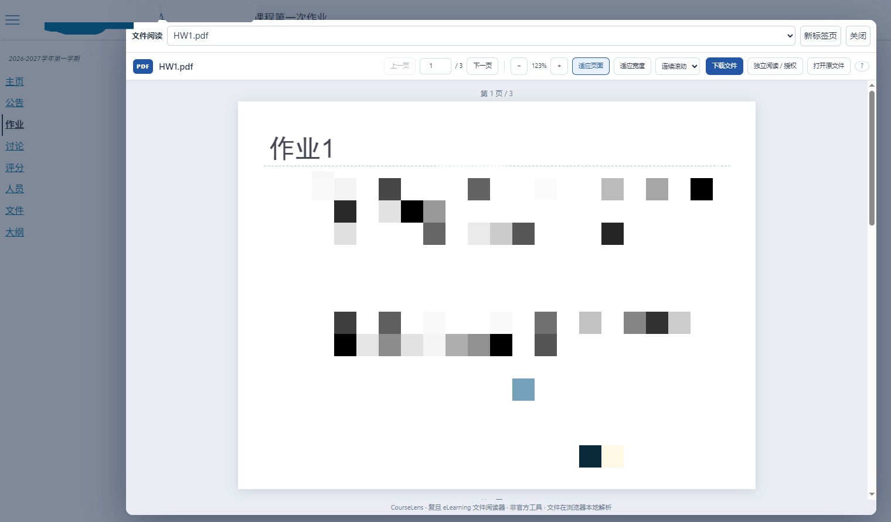
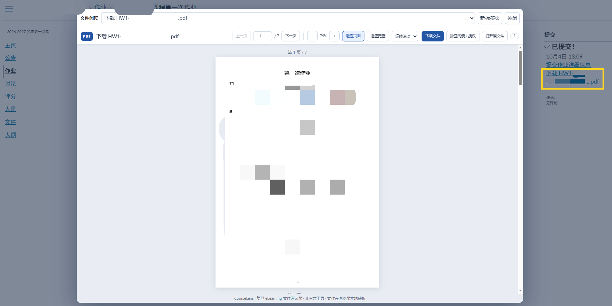
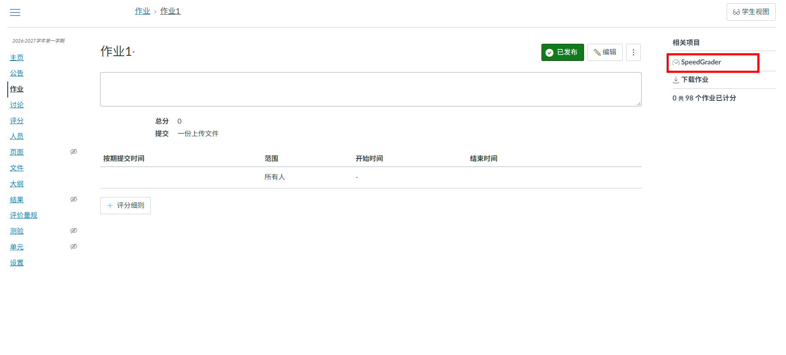
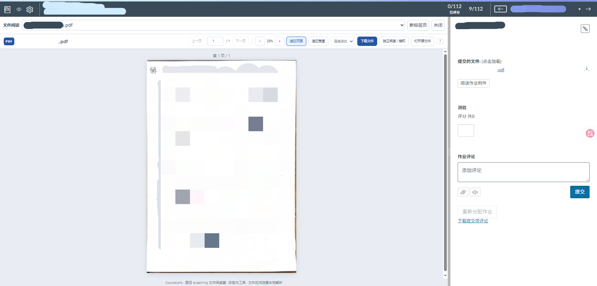
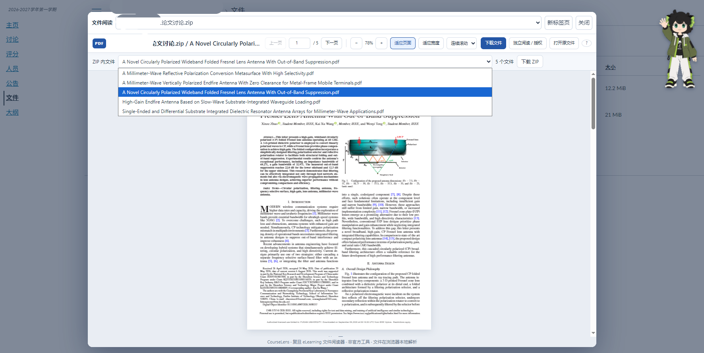

# CourseLens · 复旦 eLearning 文件阅读器

在 eLearning 点开课件或作业附件，就能直接阅读和复制文字，临时看课程资料不用下载，省点空间也省点心；助教批改作业时，也可以在 SpeedGrader 左侧看附件，右侧继续评分和写评语。支持预览 **常见图片（JPG/PNG，以及HEIC）、PDF、DOCX、PPT / PPTX、和 ZIP**。

本项目为插件，适用于 Chrome 和 Microsoft Edge。

本项目是非官方工具，与复旦大学及 eLearning 平台无官方关联。

## 能做什么

普通课程“文件”或“作业”中的附件（无论是老师发布的还是你自己提交的）会在当前页面弹窗打开，按 Esc 或点击“关闭”即可回到课程。





助教批改作业时，SpeedGrader 使用左侧的阅读区域，多个附件可以用下拉框切换。






默认“适应页面”，让一页课件、一页 PDF 或一张照片完整显示。多页文件默认连续滚动；习惯逐页看的话，可以切换成“手动翻页”。字太小时，还可以放大或选择“适应宽度”。

| 文件 | 阅读方式 |
| --- | --- |
| PDF | 翻页、跳页、缩放、文字选择；加密 PDF 可输入密码打开 |
| DOCX | 阅读分页正文、表格、图片和支持的数学公式 |
| PPT / PPTX | 按静态幻灯片阅读文字、图片和支持的图形；保留幻灯片顺序 |
| HEIC / HEIF | 直接打开苹果手机照片，无需先转换格式；多图文件目前显示第一张 |
| PNG / JPEG / GIF / WebP / BMP | 整张显示，也可以放大查看细节 |
| TXT / MD / CSV / JSON / 代码 / TEX 等 | 按纯文本阅读，支持常见中文编码 |
| ZIP | 查看包内目录和文件，选择支持的附件直接阅读，也可单独下载 |

ZIP 内的文件也能直接阅读：在目录列表中选择文件，就可以切换预览，不用先把整个压缩包下载、解压。



文件仍然可以下载。学校原有的下载按钮和 Ctrl / Command / Shift 点击保留原来的行为，需要独立阅读时也能主动打开新标签页。

## 安装

当前版本 **2.2.0**，Chrome 和 Microsoft Edge 使用同一个安装包。可以直接下载 Release，也可以克隆仓库或下载源码后自行构建。

### 下载 Release（推荐）

不用安装 Node.js，下载、解压后就能加载插件。

1. 打开 [Releases](https://github.com/Makashibata02/fudan-elearning-CourseLens/releases/latest)，在 Assets 中下载 `fudan-elearning-courselens-chromium-2.2.0.zip`。也可以[直接下载安装包](https://github.com/Makashibata02/fudan-elearning-CourseLens/releases/download/v2.2.0/fudan-elearning-courselens-chromium-2.2.0.zip)。
2. 解压到一个长期保留的文件夹。这个文件夹之后仍要保留，浏览器会从这里加载插件。
3. Chrome 打开 `chrome://extensions`，Edge 打开 `edge://extensions`。开启“开发者模式”，点击“加载已解压的扩展”，选择包含 `manifest.json` 的文件夹。
4. 在同一浏览器登录复旦 eLearning，刷新已经打开的课程页面，再点击附件文件名。

Release 中的 `chromium` ZIP 是插件安装包，`source` ZIP 是源码包，`SHA256SUMS.txt` 可用于核对下载文件。GitHub 自动提供的 “Source code (zip / tar.gz)” 也是源码，需要构建后才能加载。

### 克隆仓库

想跟进更新或修改插件，可以用 Git 获取源码：

```sh
git clone https://github.com/Makashibata02/fudan-elearning-CourseLens.git
cd fudan-elearning-CourseLens
```

接着按[从源码构建](#从源码构建)完成构建，再在扩展管理页加载 `dist/chromium`。以后在仓库目录运行 `git pull`，重新构建并重新加载插件即可更新。

### 下载源码后构建

没有使用 Git 的话，可以下载 Release 中的 `fudan-elearning-courselens-source-2.2.0.zip`；想尝试 main 的最新代码，也可以在仓库首页点击 **Code → Download ZIP**。

解压后进入含有 `package.json` 的目录，按[从源码构建](#从源码构建)运行命令，再加载生成的 `dist/chromium`。这两种源码下载方式都需要 Node.js。

### 更新与初次使用

使用 Release 更新时，替换原安装目录中的文件，在扩展管理页点击“重新加载”，再刷新 eLearning。手动安装的版本不会自动更新。已启用其他同类预览脚本或插件的话，请先停用重复版本，避免点击冲突。

### 没有学校账号，也能先试试

点击浏览器工具栏中的 CourseLens 图标，可以打开 PDF、DOCX、PPTX 和 ZIP 示例，也能选择本地文件。示例随插件打包，断网也能阅读。

## 文件与隐私

附件直接从学校或你允许的文件服务器读取，在浏览器本地解析，**不会上传到在线转换或预览服务**。阅读器所需的代码随安装包提供，不会从 CDN 临时加载；插件不会改动成绩、评语或提交状态。

默认网站权限只覆盖复旦 eLearning。如果文件跳转到其他服务器，阅读器会显示实际域名，再由你选择是否允许访问。预览会传输文件到浏览器，只有点击下载时才主动保存到下载目录。详见[隐私说明](docs/PRIVACY.md)。

## 目前的限制

DOCX、PPT 和 PPTX 的字体、复杂图表、SmartArt、特殊公式和排版可能与 Office 不同。课件当前以静态页面显示，不播放动画、音视频，也不支持加密课件；遇到缺失内容时，请下载原文件核对。旧版 DOC 需要另存为 DOCX 或 PDF，XLS / XLSX、PPTM 等暂不直接预览。

扫描 PDF 如果没有文字层，就无法选中文字；文本、Markdown 和 LaTeX 源码按纯文本显示。阅读器目前没有画笔批注、OCR 或自动评分功能。

单文件上限 100 MiB，文本预览 8 MiB，照片 5000 万像素，课件最多 500 页。ZIP 最多 2048 个文件，按选择解压并检查实际大小和 CRC；加密、分卷、ZIP64 和嵌套 ZIP 暂不直接预览。Office 文件也有压缩结构和解压大小检查，异常或过大的文件会提示下载阅读。

## 从源码构建

需要 Node.js 22.13 或更高版本，推荐 Node.js 24。在含有 `package.json` 的目录打开终端，运行：

```sh
npm ci --ignore-scripts
npm run build
```

Windows、macOS 和 Linux 使用相同命令，不需要另装 ZIP 工具。构建后，加载 `dist/chromium` 即可使用；插件安装包和校验文件也位于 `dist/`。不要省略 optional dependencies，esbuild 需要对应平台的二进制包。

如果准备修改代码，还可以运行检查：

```sh
npm test
npm run check
npm run verify:packages
```

需要导出源码包时，在 **Git 克隆得到的仓库**中运行 `npm run package:source`，再运行 `npm run verify:packages` 核对源码包。源码 ZIP 不含 `.git`，不需要执行这一步，也不影响插件构建和安装。

自动检查会在 Linux Chromium 和 Windows Edge 中加载插件，测试离线示例和模拟课程，并比较两个系统的安装包。模拟测试不代替真实课程验收，具体结果见[验证记录](docs/VALIDATION.md)。想参与维护，可以查看[贡献说明](CONTRIBUTING.md)。

## 项目目录

```text
extension/       插件页面、附件识别和各格式阅读器
scripts/         构建、打包与浏览器检查
tests/           自动测试和文件样例
docs/            隐私、验证及维护说明
  └─ images/     README 中的使用截图
third_party/     随包提供的第三方源码与许可材料
dist/            本地构建结果（不提交到 Git）
```

## 感谢与开源

CourseLens 基于 [sjy0630/fudan-elearning-pdf-preview](https://github.com/sjy0630/fudan-elearning-pdf-preview) 的独立插件分支继续开发，感谢原作者提供的 PDF 阅读基础。本仓库独立维护，`main` 为浏览器插件源码，并保留原作者版权和 Git 历史。

项目代码采用 MIT 许可证。PDF、Word、PowerPoint、HEIC 等阅读能力来自相应开源库，许可证和 HEIC 解码器对应源码随包提供，详见[第三方说明](THIRD-PARTY-NOTICES.md)和[来源说明](docs/UPSTREAM.md)。
